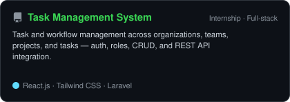
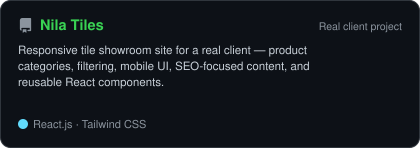
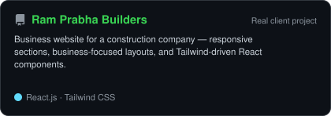
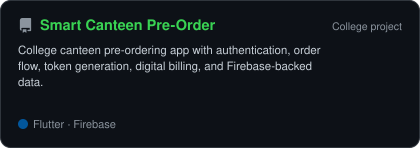
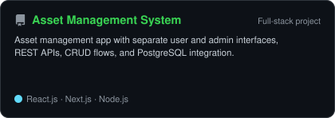
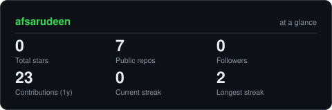
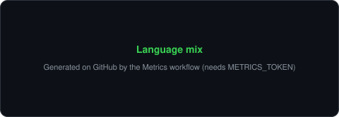
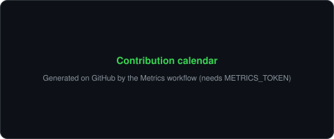

<div align="center">

<!-- PORTRAIT - generated by scripts/dotify.py from assets/portrait-source.png.
     Colour mode, so one file serves both GitHub themes. Regenerate with:
       python scripts/dotify.py assets/portrait-source.png -o assets/portrait \
         --cols 100 --equalize --detail 0.5 --color --reveal -->


<br>

<!-- NAME / TAGLINE - animated typing -->
<a href="https://github.com/afsarudeen">
  
</a>

<br>

<!-- SOCIALS -->
<a href="https://linkedin.com/in/mohammed-afsarudeen"></a>
<a href="mailto:afsarudeenma10@gmail.com"></a>
<a href="https://github.com/afsarudeen"></a>
<a href="https://nilatiles.in"></a>


</div>

---

## `~/` whoami

```console
$ cat about.txt
```

Hi, I'm **Mohammed Afsarudeen K** — a software developer focused on full-stack web
work. I build responsive frontends, REST-backed backends, and ship client-facing
products with clear structure and practical tooling.

- **Role:** Full Stack Web Development Intern @ **Jaz Infotech** (Tirunelveli) · Jul 2026 – Present
- **Based in:** Tuticorin, Tamil Nadu, India
- **Building:** client websites, task/workflow systems, and full-stack apps
- **Learning:** Python · Backend depth · AI / Generative AI · DevOps / Cloud

<br>

<div align="center">

## `~/` toolbox


</div>

---

## `~/` focus

```text
Full Stack Web Development
React Development
REST API Development
Backend Development
Authentication & Authorization
CRUD Applications
Database Integration
Responsive UI Development
Client Project Development
Git-based Team Collaboration
```

Working with JavaScript (ES6), React, Tailwind CSS, Node.js, Express, Laravel (basic),
MySQL, PostgreSQL, MongoDB (basic), plus Next.js / Flutter / Firebase where the project needs them.

---

<div align="center">

## `~/` skill radar

<table>
<tr>
<td width="50%" align="center" valign="middle">

<!-- Self-rated radar shape - edit assets/skills.json, the workflow redraws it.
     Values are a visualization scale only, not measured expertise scores. -->
<picture>
  <source media="(prefers-color-scheme: dark)"  srcset="assets/radar-dark.svg">
  <source media="(prefers-color-scheme: light)" srcset="assets/radar-light.svg">
  
</picture>

</td>
<td width="50%" align="center" valign="middle">

<!-- Live radar from real language byte counts across public repos -->
<picture>
  <source media="(prefers-color-scheme: dark)"  srcset="assets/radar-langs-dark.svg">
  <source media="(prefers-color-scheme: light)" srcset="assets/radar-langs-light.svg">
  
</picture>

</td>
</tr>
</table>

</div>

---

<div align="center">

## `~/` selected work

<!-- Cards: GitHub-backed via scripts/cards.py; unpublished/client work via scripts/local_cards.py.
     Data lives in assets/projects.json. -->

<table>
<tr>
<td width="50%">
  <a href="https://github.com/afsarudeen/task-management-system">
    <picture>
      <source media="(prefers-color-scheme: dark)"  srcset="assets/card-task-management-system-dark.svg">
      <source media="(prefers-color-scheme: light)" srcset="assets/card-task-management-system-light.svg">
      
    </picture>
  </a>
</td>
<td width="50%">
  <a href="https://nilatiles.in">
    <picture>
      <source media="(prefers-color-scheme: dark)"  srcset="assets/card-nila-tiles-dark.svg">
      <source media="(prefers-color-scheme: light)" srcset="assets/card-nila-tiles-light.svg">
      
    </picture>
  </a>
</td>
</tr>
<tr>
<td width="50%">
  <picture>
    <source media="(prefers-color-scheme: dark)"  srcset="assets/card-ram-prabha-builders-dark.svg">
    <source media="(prefers-color-scheme: light)" srcset="assets/card-ram-prabha-builders-light.svg">
    
  </picture>
</td>
<td width="50%">
  <a href="https://github.com/afsarudeen/smart-canteen-preorder">
    <picture>
      <source media="(prefers-color-scheme: dark)"  srcset="assets/card-smart-canteen-preorder-dark.svg">
      <source media="(prefers-color-scheme: light)" srcset="assets/card-smart-canteen-preorder-light.svg">
      
    </picture>
  </a>
</td>
</tr>
<tr>
<td width="50%">
  <picture>
    <source media="(prefers-color-scheme: dark)"  srcset="assets/card-asset-management-system-dark.svg">
    <source media="(prefers-color-scheme: light)" srcset="assets/card-asset-management-system-light.svg">
    
  </picture>
</td>
<td width="50%"></td>
</tr>
</table>

<sub>

| project | type | links | stack |
|---|---|---|---|
| **Task Management System** | Internship · full-stack | [GitHub](https://github.com/afsarudeen/task-management-system) | `React` `Tailwind` `Laravel` `MySQL` `REST` |
| **Nila Tiles** | **Real client project** | [Live](https://nilatiles.in) | `React` `Tailwind` |
| **Ram Prabha Builders** | **Real client project** | [Live](https://ramprababuilders.in/) | `React` `Tailwind` |
| **Smart Canteen Pre-Order** | College project | [GitHub](https://github.com/afsarudeen/smart-canteen-preorder) | `Flutter` `Firebase` |
| **Asset Management System** | Full-stack project | — | `React` `Next.js` `Node` `Express` `PostgreSQL` |

</sub>

</div>

---

### Project notes

**Task Management System** — internship engineering work covering organization, team, project, and task flows; authentication, role-based permissions, CRUD, REST integration, frontend/backend data flow, and Postman-tested APIs.

**Nila Tiles** — real client showroom site ([nilatiles.in](https://nilatiles.in)): product categories and filtering, responsive/mobile UI, navigation and SEO-focused content, reusable React components and Tailwind layouts.

**Ram Prabha Builders** — real client construction-business site ([ramprababuilders.in](https://ramprababuilders.in/)): responsive sections, business-focused layouts, React components, Tailwind CSS.

**Smart Canteen Pre-Order System** — Flutter + Firebase college canteen app: auth, orders, token generation, digital billing, Firebase auth and data.

**Asset Management System** — React/Next.js frontend with Node/Express APIs and PostgreSQL; separate user and admin interfaces with CRUD.

---

<div align="center">

## `~/` the numbers

<!-- Self-hosted cards (scripts/cards.py) — not github-readme-stats public instances. -->
<picture>
  <source media="(prefers-color-scheme: dark)"  srcset="assets/card-stats-dark.svg">
  <source media="(prefers-color-scheme: light)" srcset="assets/card-stats-light.svg">
  
</picture>

<br>



<br><br>


</div>

---

<div align="center">

## `~/` contribution calendar

<!-- 3D isometric calendar — regenerated by .github/workflows/metrics.yml -->


<br><br>

<!-- Snake — .github/workflows/snake.yml → output branch -->
<picture>
  <source media="(prefers-color-scheme: dark)"  srcset="https://raw.githubusercontent.com/afsarudeen/afsarudeen/output/snake-dark.svg">
  <source media="(prefers-color-scheme: light)" srcset="https://raw.githubusercontent.com/afsarudeen/afsarudeen/output/snake.svg">
  
</picture>

</div>

---

## `~/` currently learning

Exploring — not claimed as production expertise:

- **Python**
- **Backend development** (deeper API / service patterns)
- **AI / Generative AI**
- **DevOps / Cloud** fundamentals

---

## `~/` education

**Bachelor of Computer Applications (BCA)**  
Sadakathullah Appa College · Tirunelveli, Tamil Nadu  
2023 – 2026 · CGPA **7.56**

---

## `~/` certifications

- Full Stack Web Development
- NPTEL Soft Skill Development
- Claude with Google Vertex AI
- MongoDB Certification

---

## `~/` experience

**Full Stack Web Development Intern** — *Jaz Infotech*, Tirunelveli, Tamil Nadu  
July 2026 – Present

- Full-stack and client project development
- Responsive frontend work and REST API integration
- Backend development, authentication, and CRUD flows
- Database operations and Postman API testing
- Git/GitHub workflows and team collaboration against business requirements

---

<div align="center">

## `~/` connect

<a href="mailto:afsarudeenma10@gmail.com"></a>
<a href="https://linkedin.com/in/mohammed-afsarudeen"></a>
<a href="https://github.com/afsarudeen"></a>

<br>

<sub>`01100010 01110101 01101001 01101100 01100100 01101001 01101110 01100111 00101110 00100000 01101100 01100101 01100001 01110010 01101110 01101001 01101110 01100111 00101110 00100000 01101001 01101101 01110000 01110010 01101111 01110110 01101001 01101110 01100111 00101110`</sub>

</div>
